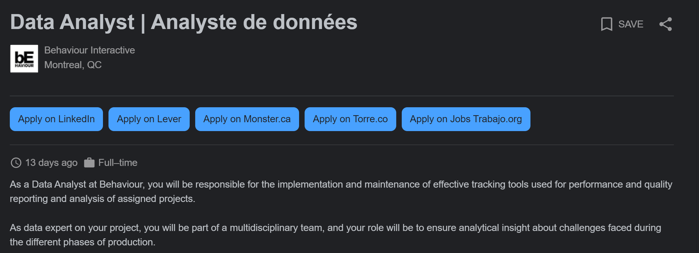

# Task 1: Data Science Careers

I was drawn to the Behaviour Interactive job listing because I had not really considered data science in the entertainment industry before. 
I like the idea of creating and updating tools that can be used by other people to monitor the performance of a product. 
This is similar to the reason why I chose the CAE job listing as well. 
From the job description, it sounds like they are aiming to find someone who can understand problems as a whole and help to do 'quality control' on a project; and not just create a machine learning or AI model to get some quantitative results. 
Lastly, I chose the Swift Medical job listing because the position was labeled as a Data Quality Analyst. 
Again, I was interested in the 'quality control' portion of this job but I also thought that the concept of their product was innovative and intriguing. 

# Task 2: Highs and Lows

Highlights: I really liked the assignment structure and schedule. 
It didn't feel too overwhelming or time consuming, but it wasn't so easy that I felt like I didn't learn anything. 
The assignments felt organized, well thought out, and fair.
There was a nice sense of accomplishment when I finished an assignment and felt like I learned a new skill.

Could have done better: This comes with this being a new course, but some assignments were ambiguous on some details and the TAs did not always answer questions consistently. 
I also think it might be because the myCourses discussion page isn't the best. 
Some of my past classes have used reddit, slack, or discord instead of myCourses discussion, so maybe one of those will work better.

Future impact: This class has made me start to apply for data science jobs after graduation! 
Data science was not something that I was really interested in pursuing before, but this class has given such a great intro to the field and emphasized what is actually important in a data science project. 
I don't have any success stories about internships of job interviews yet, but hopefully soon :)
